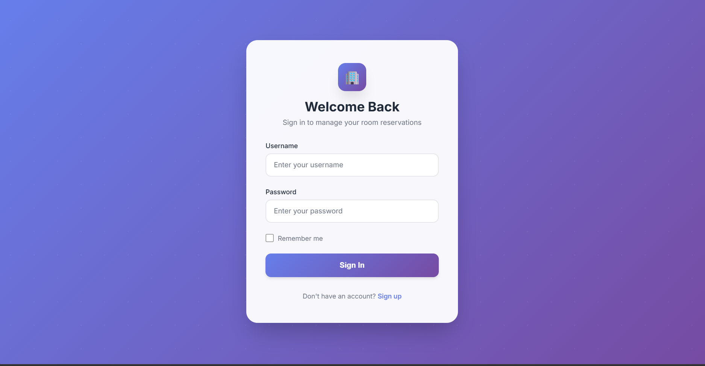
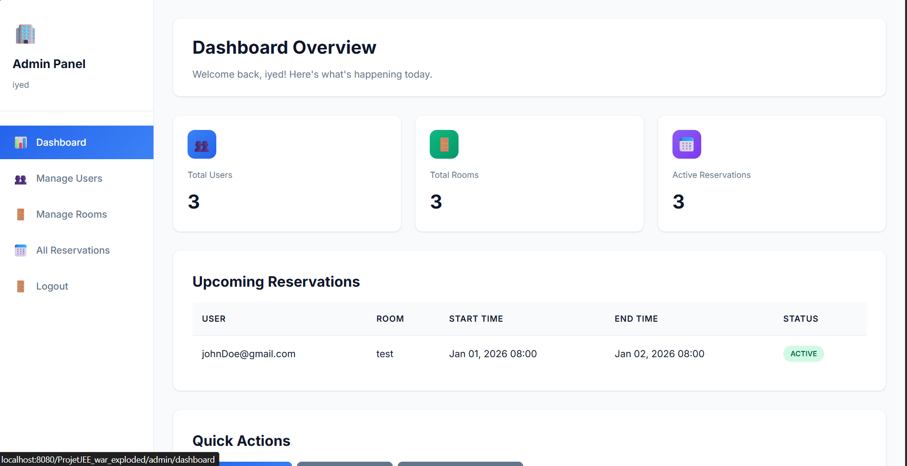
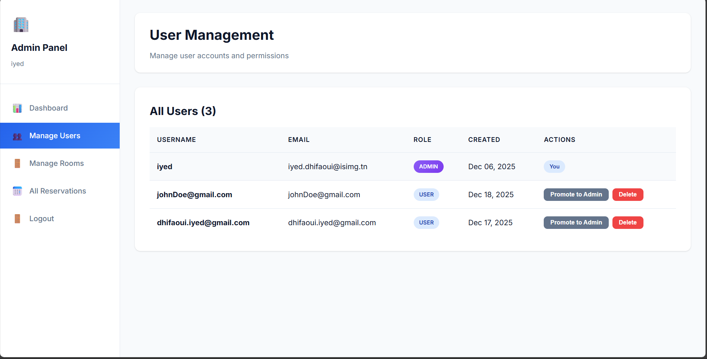
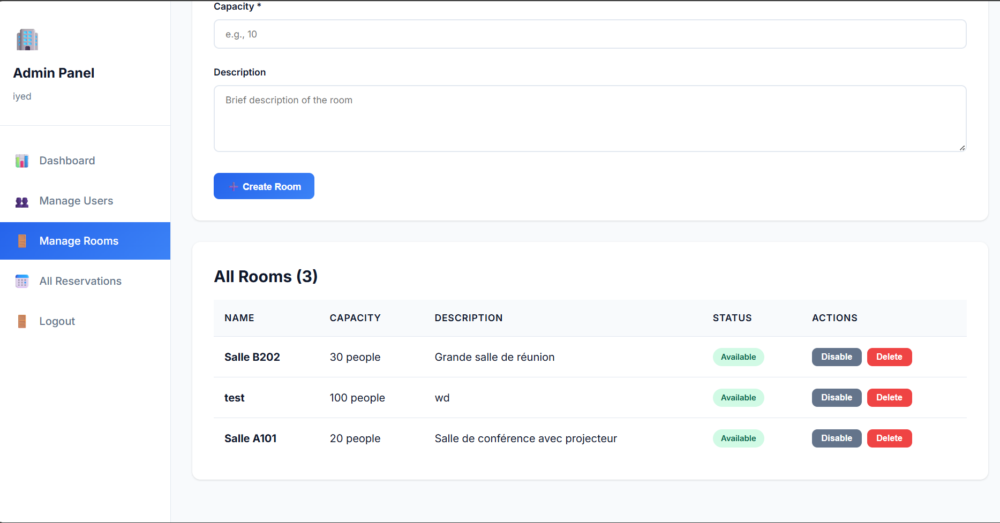
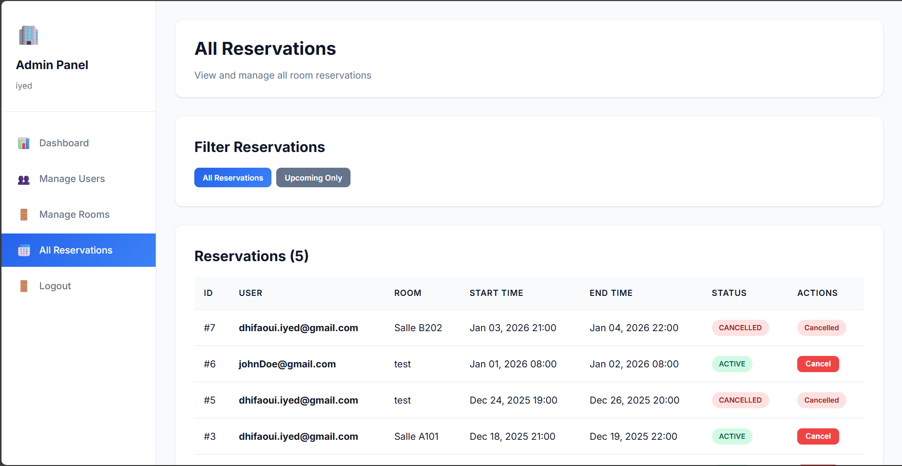
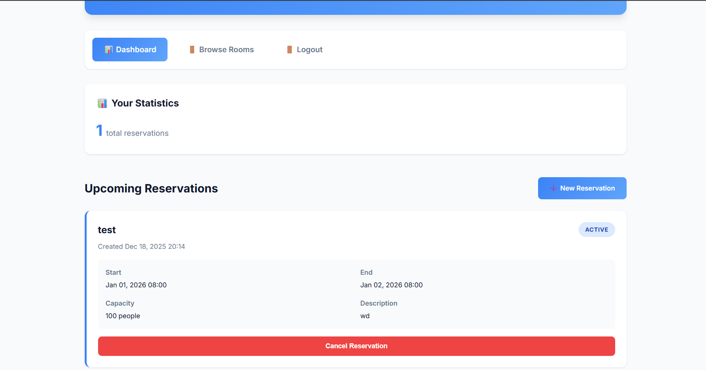
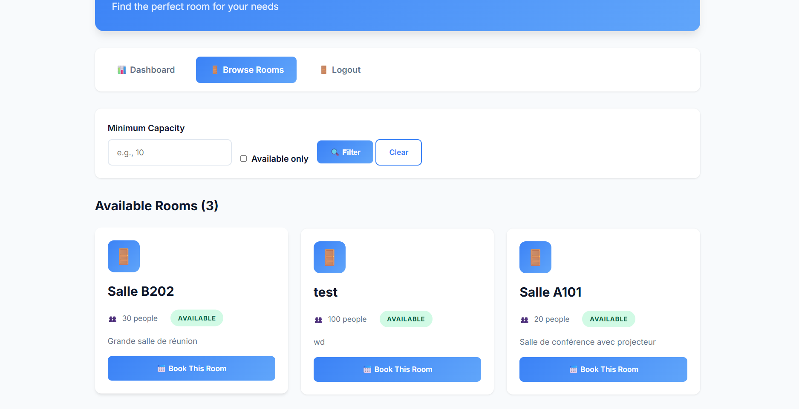

# 🏢 Room Reservation System

A comprehensive web application for managing and reserving rooms within an organization, built with Java EE, JPA/Hibernate, and PostgreSQL.



---

## 📋 Table of Contents

- [Features](#-features)
- [Screenshots](#-screenshots)
- [Technology Stack](#-technology-stack)
- [Architecture](#-architecture)
- [Setup Instructions](#-setup-instructions)
- [Usage Guide](#-usage-guide)
- [Business Rules](#-business-rules)
- [Security](#-security)
- [Troubleshooting](#-troubleshooting)

---

## ✨ Features

### 👨‍💼 Admin Features
- **Dashboard**: Overview statistics of users, rooms, and active reservations
- **User Management**: Create, update, delete users, and manage roles (Admin/User)
- **Room Management**: Create, update, delete rooms, and toggle availability
- **Reservation Management**: View all reservations with filtering options and cancel any reservation

### 👤 User Features
- **Personal Dashboard**: View upcoming and past reservations with statistics
- **Browse Rooms**: Search and filter available rooms by capacity
- **Create Reservations**: Book rooms with date/time selection
- **Cancel Reservations**: Cancel own reservations (except past ones)

---

## 📸 Screenshots

### Authentication Pages

<table>
  <tr>
    <td width="50%">
      <h4>Login Page</h4>
      
      <p><em>Secure login with session-based authentication</em></p>
    </td>
    <td width="50%">
      <h4>Signup Page</h4>
      
      <p><em>User registration with password hashing</em></p>
    </td>
  </tr>
</table>

### Admin Panel

<table>
  <tr>
    <td width="50%">
      <h4>Admin Dashboard</h4>
      
      <p><em>Overview statistics and upcoming reservations</em></p>
    </td>
    <td width="50%">
      <h4>User Management</h4>
      
      <p><em>Manage users and assign roles</em></p>
    </td>
  </tr>
  <tr>
    <td width="50%">
      <h4>Room Management</h4>
      
      <p><em>Create, edit, and manage rooms</em></p>
    </td>
    <td width="50%">
      <h4>Reservation Management</h4>
      
      <p><em>View and manage all system reservations</em></p>
    </td>
  </tr>
</table>

---

## 🛠 Technology Stack

| Layer | Technology |
|-------|-----------|
| **Backend** | Java 24, Jakarta EE (Servlets, JPA) |
| **ORM** | Hibernate 6.4.0 |
| **Database** | PostgreSQL 42.5.4 |
| **Security** | BCrypt password hashing |
| **Frontend** | JSP, Vanilla CSS |
| **Build Tool** | Maven |
| **Server** | Apache Tomcat 10.1+ |

---

## 🏗 Architecture

### Three-Layer Architecture

```
┌─────────────────────────────────────────────────────────┐
│                    Presentation Layer                    │
│              (Servlets + JSP Views + CSS)               │
└─────────────────────┬───────────────────────────────────┘
                      │
┌─────────────────────▼───────────────────────────────────┐
│                   Business Logic Layer                   │
│      (Service Classes with Validation & Rules)          │
└─────────────────────┬───────────────────────────────────┘
                      │
┌─────────────────────▼───────────────────────────────────┐
│                  Data Access Layer (DAO)                 │
│           (JPA/Hibernate Entity Management)             │
└─────────────────────┬───────────────────────────────────┘
                      │
┌─────────────────────▼───────────────────────────────────┐
│                    Database Layer                        │
│                   (PostgreSQL)                          │
└─────────────────────────────────────────────────────────┘
```

### Project Structure

```
ProjetJEE/
├── src/main/java/org/dhifaoui/projetjee/
│   ├── dao/                      # Data Access Objects
│   │   ├── UserDAO.java          # User database operations
│   │   ├── RoomDAO.java          # Room database operations
│   │   └── ReservationDAO.java   # Reservation database operations
│   │
│   ├── entities/                 # JPA Entities
│   │   ├── User.java             # User entity with BCrypt hashing
│   │   ├── Room.java             # Room entity with capacity
│   │   ├── Reservation.java      # Reservation with business logic
│   │   ├── UserRole.java         # Enum: ADMIN, USER
│   │   └── ReservationStatus.java # Enum: ACTIVE, CANCELLED
│   │
│   ├── service/                  # Business Logic Layer
│   │   ├── AuthenticationService.java    # Login/Signup logic
│   │   ├── ReservationService.java       # Reservation business rules
│   │   ├── RoomService.java              # Room management
│   │   └── UserManagementService.java    # User CRUD operations
│   │
│   ├── Servlets/
│   │   ├── admin/                # Admin Servlets
│   │   │   ├── AdminDashboardServlet.java
│   │   │   ├── AdminUserManagementServlet.java
│   │   │   ├── AdminRoomManagementServlet.java
│   │   │   └── AdminReservationServlet.java
│   │   ├── user/                 # User Servlets
│   │   │   ├── UserDashboardServlet.java
│   │   │   ├── BrowseRoomsServlet.java
│   │   │   ├── CreateReservationServlet.java
│   │   │   └── CancelReservationServlet.java
│   │   ├── LoginServlet.java
│   │   └── SignupServlet.java
│   │
│   └── util/                     # Utilities
│       └── JPAUtil.java          # EntityManager factory
│
├── src/main/webapp/
│   ├── admin/                    # Admin JSP Views
│   │   ├── dashboard.jsp
│   │   ├── users.jsp
│   │   ├── rooms.jsp
│   │   └── reservations.jsp
│   ├── user/                     # User JSP Views
│   │   ├── dashboard.jsp
│   │   ├── rooms.jsp
│   │   └── create-reservation.jsp
│   ├── css/                      # Stylesheets
│   │   ├── admin.css
│   │   ├── user.css
│   │   └── auth.css
│   ├── login.jsp
│   └── signup.jsp
│
└── src/main/resources/
    └── META-INF/
        └── persistence.xml       # JPA Configuration
```

---

## 🚀 Setup Instructions

### Prerequisites

1. **Java Development Kit (JDK) 17 or higher**
   - Download from [Oracle](https://www.oracle.com/java/technologies/downloads/) or [OpenJDK](https://openjdk.org/)
   - Set `JAVA_HOME` environment variable

2. **PostgreSQL Database**
   - Install PostgreSQL 12 or higher
   - Create database: `roomreservation`

3. **Apache Tomcat 10.1+**
   - Download from [Apache Tomcat](https://tomcat.apache.org/)

4. **Maven** (or use included mvnw wrapper)

### Database Setup

1. **Create the database:**
```sql
CREATE DATABASE roomreservation;
```

2. **Update database credentials** in `src/main/resources/META-INF/persistence.xml`:
```xml
<property name="jakarta.persistence.jdbc.url" 
          value="jdbc:postgresql://localhost:5432/roomreservation"/>
<property name="jakarta.persistence.jdbc.user" value="postgres"/>
<property name="jakarta.persistence.jdbc.password" value="your_password"/>
```

3. **Tables will be created automatically** by Hibernate on first run (DDL auto mode).

### Build and Deploy

1. **Clean and build the project:**
```bash
mvn clean package
```

2. **Deploy the WAR file:**
   - Copy `target/ProjetJEE-1.0-SNAPSHOT.war` to your Tomcat `webapps` folder
   - Or configure deployment in your IDE (IntelliJ IDEA, Eclipse, etc.)

3. **Start the server** and navigate to:
   ```
   http://localhost:8080/ProjetJEE-1.0-SNAPSHOT/
   ```

### Initial Setup

1. **Create an admin account:**
   - Go to `/signup` and create a user account
   - Manually update the database to set the user's role to ADMIN:
   ```sql
   UPDATE users SET role = 'ADMIN' WHERE username = 'your_username';
   ```

2. **Create rooms** via the admin panel at `/admin/rooms`

3. **Start using the system!** 🎉

---

## 📖 Usage Guide

### For Administrators

1. **Login** at `/login` with admin credentials
2. **Dashboard** (`/admin/dashboard`) - View system overview statistics
3. **Manage Users** (`/admin/users`) - Create, promote, demote, or delete users
4. **Manage Rooms** (`/admin/rooms`) - Add new rooms, edit details, toggle availability
5. **View Reservations** (`/admin/reservations`) - See all reservations, filter, and cancel

### For Regular Users

1. **Sign up** at `/signup` or **Login** at `/login`
2. **Dashboard** (`/user/dashboard`) - View your reservations and statistics
3. **Browse Rooms** (`/user/rooms`) - Search available rooms with filters
4. **Book a Room** - Select a room, choose date/time, and create reservation
5. **Manage Reservations** - Cancel your future reservations from dashboard

---

## 📜 Business Rules

All business rules are strictly enforced in the `ReservationService` layer:

| Rule | Description | Implementation |
|------|-------------|----------------|
| ✅ **No Double Booking** | A room cannot be reserved twice for the same time slot | `validateNoDoubleBooking()` |
| ✅ **One Reservation at a Time** | Users cannot book multiple rooms for overlapping times | `validateUserAvailability()` |
| ✅ **Past Reservations Read-Only** | Reservations in the past cannot be modified | `validateNotPast()` |
| ✅ **Time Validation** | End time must be after start time | `validateTimeRange()` |
| ✅ **Future Bookings Only** | Reservations must be in the future | `validateNotPast()` |
| ✅ **Admin Override** | Admins can cancel any reservation | `adminCancelReservation()` |

### Business Logic Example

```java
public Reservation createReservation(Long userId, Long roomId, 
                                     LocalDateTime start, LocalDateTime end) {
    // Validate time range
    if (!validateTimeRange(start, end)) {
        throw new IllegalArgumentException("End time must be after start time");
    }
    
    // Validate not in the past
    if (!validateNotPast(start)) {
        throw new IllegalArgumentException("Cannot create reservation in the past");
    }
    
    // Validate no double booking
    if (!validateNoDoubleBooking(roomId, start, end)) {
        throw new IllegalArgumentException("Room already booked for this time slot");
    }
    
    // Validate user availability
    if (!validateUserAvailability(userId, start, end)) {
        throw new IllegalArgumentException("You already have a reservation during this time");
    }
    
    // Create and save reservation
    return reservationDAO.save(new Reservation(start, end, user, room));
}
```

---

## 🔒 Security

This application implements multiple security measures:

| Feature | Implementation |
|---------|----------------|
| 🔐 **Password Security** | BCrypt hashing with strong salt |
| 🎫 **Authentication** | Session-based authentication |
| 👮 **Authorization** | Role-based access control (ADMIN/USER) |
| 🛡️ **SQL Injection Prevention** | Parameterized queries via JPA/Hibernate |
| ✅ **Input Validation** | Server-side validation in service layer |
| 🚫 **Unauthorized Access** | Servlet-level permission checks |

### Access Control

```java
// Admin-only routes are protected
if (!user.isAdmin()) {
    response.sendRedirect("/user/dashboard");
    return;
}

// Session validation on every request
if (session == null || session.getAttribute("user") == null) {
    response.sendRedirect("/login");
    return;
}
```

---

## 🎨 Design Highlights

### Modern UI/UX Features

- 🎨 **Premium Gradient Design** - Beautiful gradient backgrounds and buttons
- 🃏 **Card-Based Layouts** - Clean, organized information display
- 📱 **Responsive Design** - Works seamlessly on desktop, tablet, and mobile
- ✨ **Smooth Animations** - Hover effects and smooth transitions
- 🎯 **Color-Coded Status** - Visual indicators for availability and status
- ⚡ **Fast & Lightweight** - Vanilla CSS, no heavy frameworks

### CSS Architecture

```css
/* Modern gradient buttons */
.btn-primary {
    background: linear-gradient(135deg, #667eea 0%, #764ba2 100%);
    transition: transform 0.2s;
}

/* Card hover effects */
.card:hover {
    transform: translateY(-5px);
    box-shadow: 0 10px 25px rgba(0,0,0,0.2);
}
```

---

## 🔧 Troubleshooting

### Common Issues

#### 🔴 Database Connection Error

**Symptoms:** Application fails to start, connection refused errors

**Solutions:**
1. Verify PostgreSQL is running: `sudo systemctl status postgresql`
2. Check database credentials in `persistence.xml`
3. Ensure database `roomreservation` exists
4. Verify PostgreSQL port (default: 5432) is not blocked

#### 🔴 Build Errors

**Symptoms:** Maven build fails, compilation errors

**Solutions:**
1. Ensure `JAVA_HOME` is set correctly
2. Run `mvn clean install` to refresh dependencies
3. Check Java version: `java -version` (should be 17+)
4. Delete `target` folder and rebuild

#### 🔴 LazyInitializationException

**Symptoms:** Hibernate throws lazy initialization errors

**Solutions:**
- All DAO queries use `JOIN FETCH` for User and Room entities
- If you add new queries, ensure eager loading:
```java
"SELECT r FROM Reservation r JOIN FETCH r.user JOIN FETCH r.room WHERE ..."
```

#### 🔴 Login Issues

**Symptoms:** Unable to login with correct credentials

**Solutions:**
1. Verify user exists: `SELECT * FROM users WHERE username = 'yourname';`
2. Check password hashing is working
3. Clear browser cookies and session
4. Verify session timeout settings

---

## 📊 Database Schema

### Entity Relationships

```
┌─────────────┐         ┌──────────────┐         ┌─────────────┐
│    User     │         │ Reservation  │         │    Room     │
├─────────────┤         ├──────────────┤         ├─────────────┤
│ id (PK)     │◄───────┤│ id (PK)      │├────────►│ id (PK)     │
│ username    │ 1     ∞││ user_id (FK) ││∞     1 │ name        │
│ email       │         │ room_id (FK) │         │ location    │
│ password    │         │ start_time   │         │ capacity    │
│ role        │         │ end_time     │         │ is_available│
│ created_at  │         │ status       │         │ created_at  │
└─────────────┘         │ created_at   │         └─────────────┘
                        └──────────────┘
```

---

## 🚀 Future Enhancements

Potential features for future versions:

- 📧 **Email Notifications** - Automatic confirmation and reminder emails
- 📅 **Calendar Integration** - Interactive calendar view for bookings
- ⭐ **Room Rating System** - User feedback and ratings for rooms
- 🔔 **Real-time Updates** - WebSocket-based live availability
- 📊 **Advanced Analytics** - Usage statistics and reporting dashboard
- 🌐 **Multi-language Support** - Internationalization (i18n)
- 📱 **Mobile App** - Native iOS/Android applications
- 🔗 **API Endpoints** - RESTful API for third-party integrations

---

## 📝 License

This project is created for educational purposes as part of a Java EE course.

---

## 👨‍💻 Developer

**Developed by:** Dhifaoui Iyed

**Course:** Advanced Java EE Development

**Year:** 2024-2025

---

## 🆘 Support

For issues, questions, or contributions:

1. Check the [Troubleshooting](#-troubleshooting) section
2. Review existing documentation
3. Contact the course instructor
4. Refer to official documentation:
   - [Jakarta EE](https://jakarta.ee/)
   - [Hibernate](https://hibernate.org/orm/documentation/)
   - [PostgreSQL](https://www.postgresql.org/docs/)

---

## 🙏 Acknowledgments

- Jakarta EE and Hibernate communities for excellent documentation
- PostgreSQL team for the robust database system
- Course instructors for guidance and support

---

Made with ❤️ for learning Java EE
